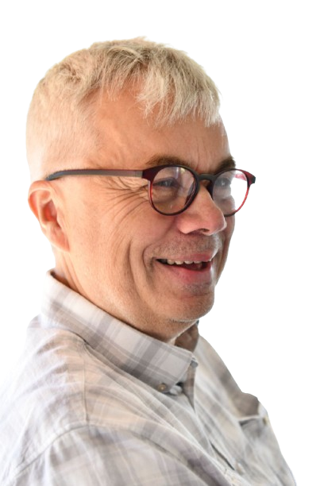

## Fredrik Svärd 

Software engineer / Test Developer )

---

## About Me  
I have a strong interest in technology and IT, including working with hardware and embedded systems, and I enjoy working in teams. 

My motivation comes from continuously learning new things in varied environments, ideally alongside curious colleagues. I'm often described as driven, result-oriented, structured, and easygoing.

---

## Technical Skills

### Language
- ***Python***  
- C/C++  
- ***Ruby***  
- C#  
- Javascript
- Rust 
- Bash scripting
- Groovy
- BDD/TDD (Test Development)  

### Infrastructure
- Git/GitLab/Github/BitBucket
- Jenkins/Github actions
- Kubernetes / Helm / Docker  
- Kafka/Google Protobuf/ Avro  
- REST API, Microservices  
- PostgreSQL, MongoDB  
- Linux, U-Boot, Bootloaders  
- Ansible
- Flask, fastapi
- Python packaging

### Misc 
- Embedded systems
- Test Automation  
- Data Communication
- Medtech
- Automotive
- Micro Services
- Confluence / Jira / Jama 
- Requirements Engineering  
- Agile Methodologies, Team Player

---

## Education & Certifications  
Master of Science in Computer Engineering, Luleå University of Technology (1984–1989)  
- Mastering Advanced Git, O’Reilly (2020)  
- ISTQB Foundation Certificate (2011)  
- Agile Engineering Practices, O’Reilly (2024)
- Systems Engineering and Lifecycle Management (2024), CAG Syntell
- Internet of Things, IoT (2024), [Linnaeus University](https://lnu.se/en/)
- (Full list available upon request)

---

## Selected Projects & Assignments

### Software development and test - Atlas Copco, 2025-
- Develop automation tests for verifing Atlas Copco products
- Verification of new software and hardware releases

### Programming Instructor – Tre (3), 2024  
- I developed and delivered an advanced programming course covering several technical areas.
- I independently created and tailored the course materials to provide in-depth knowledge in Python programming, version control with Git, containerization using Docker and Podman, Exploratory Data Analysis (EDA), and web development using frameworks such as Flask and FastAPI.

### Test Developer – Svenska Spel, 2015–2024  
- Developed and maintained **integration tests** for backend services related to sports, racing, poker, and sports betting.  
- Wrote tests in **Gherkin/BDD**, clearly mapping requirements to test scenarios.  
- Worked in a **CI/CD-driven environment**, where full integration test suites had to pass before merging feature branches to master, minimizing regression risks.  
- Backend services were implemented as **microservices** deployed in **Kubernetes/Docker** environments.  
- Integrated internal services with external vendor modules using **mocking techniques** in test environments.  
- Collaborated closely with the development team to ensure high test coverage and system reliability.  
- Tools and technologies used:  
  `Python`, `C#`, `Kubernetes`, `Helm`, `Docker`, `Jenkins`, `Git`, `JSON`, `YAML`, `Poetry`, `BDD/Behave`, custom Python package development.

### Developer – Ericsson, 2013–2015  
- Worked on the next-generation radio base station platform within Ericsson’s R&D division.
- Contributed to the migration from a proprietary RTOS (OSE) to Linux with a soft real-time kernel, based on Wind River distribution.
- Involved in low-level driver integration, hardware abstraction layers, and real-time behavior tuning.
- Used tools and processes including GCC, GDB, Git, Jenkins, Python, and CI pipelines tailored for embedded development.

### Integration Consultant – Kaj63 (Bolagsverket), 2011–2013
As a consultant from Kaj63, I worked on a major migration project for Bolagsverket, transitioning core business applications from legacy mainframe systems to a modern Linux-based development and production environment. My role included:

- Acting as a technical integrator and mentor, supporting teams in adopting new tools and workflows.
- Assisting with the setup and automation of build and deployment processes using Jenkins, Subversion, and bash scripting.
- Supporting the migration and adaptation of Cobol-based systems to run in the new platform.
- Providing hands-on development and scripting in Python, shell, and Linux environments, including development in Eclipse.

The assignment focused on improving maintainability and reproducibility of the system landscape during the transition to a modern software stack.

### Software Engineer – Thoreb IT Vehicle, 2010–2011
At Thoreb IT Vehicle, I worked as an embedded systems developer for vehicle-mounted onboard computers. My key responsibilities included:

- Board bring-up and low-level software development for custom embedded platforms based on Motorola processors.
- Porting and configuring U-Boot bootloaders for proprietary hardware designs.
- Integrating and adapting various vehicle-specific sensors, including accelerometers, gyroscopes, and gear system interfaces.
- Implementing firmware and hardware abstraction layers to ensure reliable data acquisition and communication within in-vehicle networks.

This role required deep hardware–software integration, real-time debugging, and strong collaboration with hardware engineers to validate new designs.

### Software Engineer – C-RAD Imaging, 2007–2010
At C-RAD Imaging, I developed low-level software for the GEMini ED flat panel detector system used in high-precision radiotherapy imaging. My primary responsibilities included: 

- Developing a custom Linux device driver to interface with the GEM-based detector hardware.
- Implementing a user-space application that utilized the driver to capture raw digital image data from the detector.
- Enabling TCP/IP socket-based streaming of image data for integration with external image processing and diagnostic systems.
- The system supported real-time imaging up to 30 fps at full resolution (1024×1024), and achieved high sensitivity at low radiation doses. The technology was based on Gas Electron Multiplier (GEM) readout and required careful handling of synchronization, data buffering, and performance tuning for clinical use.

(Full list available upon request)

---

## Small projects

Small projects on [PyPi](https://pypi.org/) to be updated on tools like git, github actions, uv/python

#### Packaging

- [morningstar-fund-scraper](https://pypi.org/project/morningstar-fund-scraper)
- [midsummer](https://pypi.org/project/midsummer)

#### Scripts

- [elspot](https://github.com/nfredrik/otvunget)
- [IoT project](https://github.com/nfredrik/mickarucken)

---

## Outside of Work  
I play trombone in various ensembles (jazz/classical), enjoy cross-country skiing, and have a passion for outdoor activities in snowy environments. To clear my mind during the week, I like to take long walks.

## Contact

Questions? :email:  [fredrik.svard@gmail.com](fredrik.svard@gmail.com)

  
